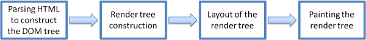

# 브라우저의 작동 원리

## 브라우저의 주요 기능

browser의 주요 기능은 '사용자가 선택한 리소스를 서버에 요청, 브라우저 창에 표시하여 사용자에게 응답' 하는 것이다. 

사용자가 접속한 웹 페이지의 리소스들을 웹 브라우저는 웹 서버에 요청하게 된다. 서버가 브라우저에게 전달한 응답인 html, css 등의 문서를 브라우저는 해석 후 사용자에게 제공한다.

브라우저는 HTML, CSS 명세에 따라서 HTML을 해석, 표시하게 되는데 이 명세는 웹 표준화 기준인 W3C(World Wide Web Consortium)에서 정해진다.

 
 

## 브라우저의 기본 구조

- 사용자 인터페이스
    - 주소 표시줄, 이전/다음 버튼 등등
    - 요청한 페이지가 표시되는 창을 제외한 브라우저의 모든 부분

- 브라우저 엔진
    - html, css 등 웹 페이지 구성을 위한 자료를 해석하여 사용자의 장치에 맞게 시각적인 표현으로 변환하는 역할

- 렌더링 엔진
    - 요청한 리소스를 표시
    - html, css를 파싱하여 화면에 나타냄

- 통신
    - HTTP 요청과 같은 네트워크 호출

- UI 백엔드
    - 기본적인 위젯 표시

- JS 인터프리터
    - JavaScript 코드 분석, 실행

- 데이터 저장
    - 자료 저장
    - 쿠키를 저장하는 것과 같이, 모든 종류의 자원을 하드디스크에 저장해야 할 수 있다.
    - LocalStorage, IndexedDB, WebSQL, FileSystem 과 같은 저장소를 지원

 
 

## 렌더링 엔진

렌더링 엔진의 역할은 요청 받은 내용을 브라우저 화면에 표시하는 것이다. 렌더링 엔진은 HTML, XML 문서와 이미지를 표시할 수 있다.

브라우저마다 각각 다른 렌더링 엔진을 사용하는데, 인터넷 익스플로러는 `Trident`, 파이어폭스는 `Gacko`, 사파리는 `webkit`, 크롬과 오페라는 webkit에서 파생된 `Blink`를 사용한다.

### 렌더링 엔진 동작 순서

1. DOM 트리 구축을 위한 HTML 파싱
2. 렌더 트리 구축
3. 렌더 트리 배치
4. 렌더 트리 그리기(paint)

렌더링 엔진은 HTML 문서 구문 분석 후, 컨텐츠 트리를 DOM 노드로 변환한다. 
외부 CSS 파일과 스타일 요소 모두에서 스타일 데이터를 구문 분석 한다.(파싱) 
HTML의 규칙에 맞게 스타일 정보를 사용하여 렌더 트리를 생성한다. 
렌더 트리 구성 후, 배치 프로세스를 거친다. 
해당 프로세스는 각 노드가 어느 곳에 표시되어야 하는지 정확한 좌표를 제공한다. 
렌더 트리가 탐색되고, 각 노드는 UI 백엔드 레이어를 사용해 그리기 과정을 거친다. (배치 + 그리기) 
모든 내용을 한번에 파싱하고 배치하기에 속도가 매우 느리기에 파싱과 배치과정은 함께 일어난다. 
네트워크로부터 나머지 내용이 전송되기 기다리는 동시에, 받은 내용의 일부를 먼저 화면에 표시한다. 

- webkit

- Gecko

> 렌더 트리(Render Tree) 
> - Gecko : 형상 트리, 각 요소를 형상(Frame, Frame Tree)
> - Webkit : 렌더 객체로 구성되어 있는 렌더 트리

> 배치
> - Geko : Reflow
> - Webkit : Layout

 
 

## 파싱(parsing)

파싱은 브라우저가 코드를 이해하고 사용할 수 있는 구조로 변환하는 것을 의미한다. 파싱 결과는 보통 문서 구조를 나타내는 노드 트리이다.

HTML은 일반적으로 사용하는 상향식, 하향식 파서로는 파싱이 되지 않는다
- 언어의 너그로운 속성
- HTML 오류에 대한 브라우저의 관용
    - 잘 구성되지 않은 HTML 문서를 처리해야 하므로 오류에 관대
- 변경에 의한 재파싱 과정
    - 파싱 프로세스가 직접 입력을 수정할 수 있다.

위의 이유 때문에 브라우저는 HTML 파싱을 위해서 별도의 파서를 만들어 사용한다.

1. HTML, CSS는 파싱되어 DOM으로 변환되고, 렌더 트리로 결합된다.
2. 생성된 렌더 트리를 기반으로 Layout(배치)를 거치고 브라우저에 그리기 과정을 진행한다.

 
 

## 브라우저 렌더링 과정

렌더링이란 문서(HTML, CSS, JS)가 브라우저 화면에 출력되는 과정을 말한다.

### 렌더링 과정
1. 사용자가 웹 페이지의 리소스를 요청
2. 서버에서 받아온 리소스들(HTML, CSS) 문서를 DOM으로 변환하여 DOM 트리 구축
    - 파싱 과정을 거쳐 노드 트리를 생성
3. 변환된 DOM 트리로 렌더 트리 생성
    - 렌더 트리에는 CSS 파일, style 요소의 정보가 포함되어 있으며, 화면에 필요한 노드들로만 구성
4. layout - 렌더트리에서 노드들이 가지고 있는 속성과 스타일에 따라서 브라우저에 어떤 크기로 어떤 위치에 출력할지 받아온다.
5. paint - 레이아웃이 완료되면 화면에 그린다.

### 2번 과정에서 리소스에 JS가 포함되어 있다면?
- HTML 파서는 script 요소를 만나면 DOM 생성을 중지하고 JS 엔진에 권한을 넘긴다.
- JS가 끝나면 다시 HTML 파서로 권한을 넘기고, 중지되었던 시점부터 DOM 생성을 진행한다.

따라서 script 위치에 따라 DOM 생성이 지연될 수 있다. 또한 DOM이 생성되지 않은 상태에서 DOM을 조작하면 에러가 생긴다.