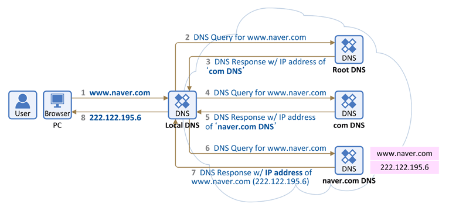

# DNS의 작동원리와 Domain Name

## DNS(Domain Name System) 란?

Domain Name System은 호스트의 도메인 네임을 네트워크주소(ex: 192.111.0.0)로 변환하거나, 그 반대의 역할을 수행하는 시스템이다.

예를들어 우리가 자주 접하는 naver.com , google.com 등 모두 dns를 가진 Domain Name 이라고 할 수 있다.

IP주소를 브라우저에게 제공하면 해당 서버에서 홈페이지를 제공하는 식으로 동작하지만, ip주소를 외우고 있기엔 복잡하고 힘들기에 명칭을 따로 지정해주는 시스템이다.

> 마치 전화번호를 이름으로 저장해두는 것 처럼

 

사용자는 웹브라우저에 도메인을 입력하면 다음과 같은 과정을 겪게 된다.

1. 도메인 주소를 브라우저에 입력하게 되면, 도메인 주소를 가지고 있는 네임서버(DNS서버)에 접속

2. 네임서버에 접속한 도메인과 연결된 IP 정보를 확인하고, IP를 사용자 PC에 전달

3. 사용자 PC는 전달받은 서버의 IP 주소로 접속

4. 서버 IP로 연결된 브라우저에 서버의 내용(홈페이지)를 출력

 
 

## DNS 작동 원리

클라이언트가 Domain Name을 브라우저에 검색하면, 도메인 정보가 저장된 네임 서버(DNS 서버)로 가서 도메인과 일치하는 IP주소로 가라고 지시하고, 다시 그 IP주소로 접속하게 되면 홈페이지가 열리는 구조이다.

단지 DNS 서버에서 도메인 & IP정보를 얻는 과정이 복잡하게 되어 있는데 전세계에 도메인 수가 너무 많기 때문에 서버 종류를 계층화 해서 단계적으로 처리하기 때문이다.

 

### DNS 동작 순서

1. 웹 브라우저에 도메인 네임을 입력하면 먼저 PC에 저장된 Local DNS(기지국 DNS 서버)에게 해당 도메인 네임에 해당하는 IP주소를 요청한다. 이때 Local DNS에는 입력한 도메인 네임에 해당하는 IP 주소가 있을 수도 있고 없을 수도 있다. 만일 예전에 접속했던 기록이 있어서 Local DNS에 접속정보가 캐싱이 되어있어 사용자의 PC에 IP주소를 제공한다.

2. Local DNS는 입력한 도메인 네임을 찾기 위해 다른 DNS 서버들과 통신(DNS 쿼리)을 시작하고 먼저 `Root DNS 서버`에게 도메인 네임의 IP 주소를 요청한다.

3. Root DNS 서버는 해당 도메인 네임의 IP 주소를 찾을 수 없어 Local DNS 서버에게 다른 DNS 서버에게 요청하라고 응답한다.

4. Local DNS 서버는 com 도메인을 관리하는 `TLD DNS 서버(최상위 도메인 서버)`에 다시 도메인 네임에 대한 IP 주소를 요청한다.

5. com 도메인을 관리하는 DNS 서버에도 해당 정보가 없으면, Local DNS 서버에게 다른 DNS 서버에게 요청하라고 응답한다.

6. 이제 Local DNS 서버는 `Authoritative DNS 서버`에게 다시 해당 도메인 네임의 IP 주소를 요청한다.

    > Authoritative DNS Server는 실제 개인 도메인과 IP 주소의 관계가 저장/변경되는 서버로 일반적으로 도메인/호스팅 없체의 네입서버를 말하지만, 개인이나 회사 DNS 서버 구축을 한 경우에도 해당된다.

7. Authoritative DNS 서버에는 해당 도메인 네임의 IP 주소가 있기에 Local DNS 서버에게 해당하는 IP 주소값을 응답한다.

8. Local DNS는 해당 IP 주소를 키싱을 하고 이후 다른 요청이 있을시 응답할 수 있도록 IP 주소 정보를 PC에 전달해 준다.

 

> Local DNS 서버가 여러 DNS 서버에 차례 대로 (Root DNS 서버 -> TLD DNS 서버 -> Authoritative DNS 서버) 요청하여 답을 찾는 과정을 `재귀적 쿼리 (Recursive Query)` 라고 한다.

 
 

### Root DNS Server

처음 브라우저에서 도메인 네임을 입력했을 때 Local DNS 즉 기지국 DNS에게 IP 주소를 물어보았다. 만약 Local DNS에 해당 도메인에 대한 IP 주소가 없을 때에 Local DNS 서버는 ROot DNS 서버에게 물어보게 된다.

Root DNS는 최상위 DNS 서버로 해당 DNS부터 시작해서 아래로 딸린 node DNS 서버에게로 차례차례 물어보는 구조로 짜여져 있다.

즉, 모든 DNS 서버들은 이 Root DNS Server의 주소를 기본적으로 갖고 있다는 뜻이다.

하지만 Root DNS Server의 목록에도 해당 도메인 네임의 IP 주소가 없다면 다음 DNS 서버로 리턴해주는데 그것이 바로 TLD 서버이다.
예를들어 도메인이 "google.com" 이라면 뒤의 문자를 보고 .com을 관리하는 TLD 서버에서 물어보라고 정보를 주는 것이다.

> Root DNS Server : "나에게 해당 도메인 주소가 없다. 대신 google.com 주소중에 .com의 주소를 알고 있으니 .com DNS 주소에게 요청해라"

 

### TLD (Top-Level Domain)

인터넷 도메인의 체계에서 최상위는 Root 로서 시작점이 된다. 그리고 이 루트 도메인 아래단계에 있는 것을 1단계 도메인이라고 하며 이를 TLD라고 한다.

TLD는 국가명을 나타내는 국가 최상위 도메인과 일반적으로 사용되는 일반 최상위 도메인으로 구분된다.

도메인을 구입할 경우 1단계의 도메인중에 하나를 선택하고 원하는 도메인명을 지정하여 등록한다.

 

### Second-Level DNS Server (2차 도메인)

Root DNS서버에서 리턴해준 TLD 서버주소를 기지국 DNS 서버에서 받아서 다시 TLD 서버에 요청을 했었고, TLD 서버에서는 Second-level DNS 서버를 return 해준다. 예컨데, "google.com"을 요청했다면, TLD 서버에서 .com을 파악하고 그 전에 달린 문자열을 보고 구글 서버에게 요청을 하는 것이다. 그렇게 요청 받은 Second DNS 서버는 자체적으로 sub 도메인 서버로 넘기게 된다.

### Sub DNS Server (최하위 서버)

서브 도메인 서버는 www. dev. mail. cafe. 등을 구분하는 최하위 서버를 말한다. 네이버 서버라도 그 안에서 홈, 메일, 블로그, 카페 등 여러 서비스가 있는데 이 서비스들을 구분하는 도메인 네임이라고 보면 된다.

 

 
 

## DNS Cache

위의 과정들을 통해 "www.google.com"의 IP 주소를 응답 받았는데 몇 분 후에 다시 "www.google.com"에 방문하려고 한다면, 위의 과정을 반복해야 할까? 

이는 너무 비효율적이기에 PC에 DNS Cache라는 캐시를 활용해 자주 쓰는 Domain Name 주소를 저장해 놓는다.

> 하지만 DNS Cache를 사용함에 있어서 주의할 점은 네트워크 오류, 바이러스로 인해 캐시정보가 변조될 수도 있다. 즉, 톡정 도메인을 입력했을 때 원래의 IP 주소가 아닌 해킹된 사이트의 IP 주소로 변경이 될 수 있기에 주기적으로 캐싱된 DNS를 정리해 주어야 할 것이다.