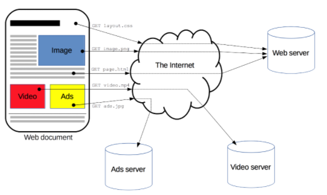
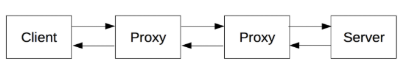

# HTTP는 무엇일까?

## HTTP
HTTP(Hyper Text Transfer Protocol)의 약자로 서버와 클라이언트가 서로 데이터를 주고받기 위해 사용되는 통신 `프로토콜`을 말한다.

HTTP는 웹에서 사용하는 프로토콜로 `TCP/IP` 기반으로 요청과 응답을 전송한다.

## HTTP의 특징
- HTTP 통신은 클라이언트의 요청(request)와 그에 대한 서버의 응답(response)으로 이루어져있다.
- TCP/IP를 이용하는 응용 프로토콜이다.
- HTTP는 연결 상태를 유지하지 않는 `비연결성` 프로토콜이다.
- `Stateless` : HTTP는 연결을 유지하지 않는 프로토콜이기에 서버는 클라이언트를 식별하지 못한다. 따라서 같은 클라이언트에서 계속 요청을 보내더라도 그 요청은 각각 독립적으로 처리된다.

 

 

client인 웹 브라우저가 HTTP를 통해 server로부터 웹페이지나 그림정보를 요청(HTTP REQUEST)하면, server는 이 요청에 응답(HTTP RESPONSE)하여 필요한 정보를 클라이언트에게 전달한다.

HTTP는 HTML문서와 같은 리소스들을 가져올 수 있도록 해주는 프로토콜이다.
HTTP는 웹에서 이루어지는 모든 데이터 교환의 기초이며, `client-server` 프로토콜이기도 하다.
>`client-server` 프로토콜이란 수신자 측에 의해 요청이 초기화 되는 프로토콜을 의미

하나의 완전한 문서는 텍스트, 레이아웃 설명, 이미지, 비디오, 스크립트 등 불러온 하위 문서들로 재구성된다.

 

 

## HTTP 기반 시스템의 구성요소

요청은 하나의 개체, 사용자 에이전트(혹은 프록시)에 의해 전송된다.

각각의 개별적인 요청들은 서버로 전송되며, 서버는 요청을 처리하고 응답을 제공한다.
이 요청과 응답 사이에는 여러 개체들이 있는데, 다양한 작업을 수행하는 `게이트웨이` 또는 캐시 역할을 하는 `프록시` 등이 있다.

 

 

## Cookie & Session

앞서 HTTP는 `stateless`하다고 했다. 그렇다면 우리는 어떻게 일관된 방식으로 서버와 상호작용을 할까?
>사이트에서 로그인을 하고 다른페이지로 넘어가도 로그인이 유지되는 현상은 어떻게 유지될까?

### Cookie
- cookie는 클라이언트 로컬에 저장되는 key와 value가 들어있는 작은 데이터 파일
- cookie는 클라이언트 상태 정보를 로컬에 저장했다가 참조한다

>cookie 사용 예시
>- 사이트에서 '로그인시 아이디와 비밀번호 저장'
>- 팝업창이 떴을 때, '오늘 하루 이 창을 보지 않음'

### Session
- session은 cookie를 기반하고 있지만, 사용자 정보 파일을 브라우저에 저장하는 cookie와 달리 session은 서버 측에서 관리한다.
- 서버는 클라이언트를 구분하기 위해 짧은 유효기간의 session ID를 부여하고 클라이언트는 부여받은 session ID를 cookie에 저장하여 브라우저를 종료할 때 까지 인증상태를 유지한다.
- session ID의 유요기간은 개발과정에서 직접 설정 가능하다.
- 사용자의 정보를 서버에 두기 때문에 cookie보다 보안에 좋지만, 사용자가 많아질 수록 서버 메모리 혹은 db공간을 많이 차지하게 된다.

>session과 cookie를 이용한 로그인 동작 방식
>   - 클라이언트가 서버에 접속시 session ID를 발급 받는다.
>   - 클라이언트는 session ID를 쿠키에 저장한다.
>   - 클라이언트는 서버에 HTTP통신을 할 때, 쿠키의 session ID를 함께 서버로 전달
>   - 서버는 session ID를 받고 사용자를 식별 후 그에 맞는 응답 전송

 

웹 개발자들은 어떤정보를 쿠키로 저장할지 세션으로 저장할지 적절한 판단을 내리는것이 중요

쿠키는 보안적인 문제를 세션은 서버 메모리 차지에 대한 문제야기로 인해 최근에는 이런 문제들을 보완한 토큰 기반의 인증방식을 사용하는 추세이다.