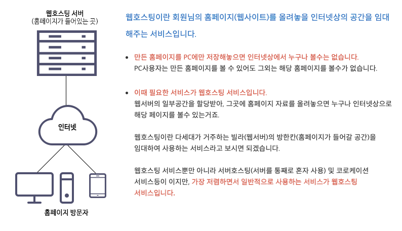
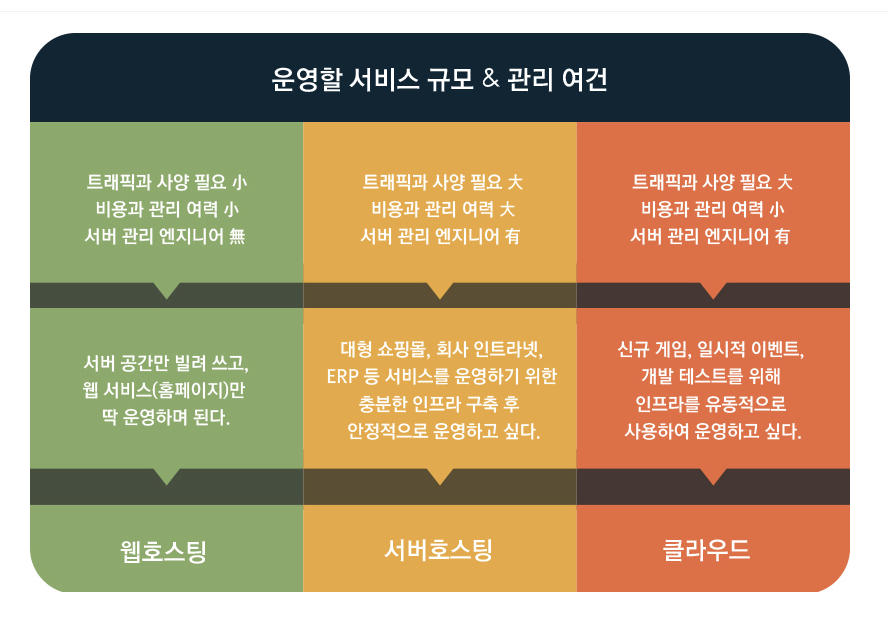

# 호스팅이란?

호스팅이란 서버 혹은 웹사이트를 인터넷 상에서 이용할 수 있게 하는 공간을 임대 해주는 서비스다. 웹 호스팅은 웹사이트를 구성하는 여러 파일을 온라인에서 볼 수 있게 해준다.

호스팅을 하기 위해 임대하는 서버의 공간은 호스팅의 종류에 따라 다른데, 웹사이트나 웹 파이지를 구성하기 위한 호스팅과, 서버를 열기 위한 호스팅은 관리방법과 제공받는 서비스 등이 다르다.

 

## 웹 호스팅

웹 호스팅은 려거 고객이 하나의 서버를 함께 사용하는 형태이다.  
하나의 서버를 나우어 쓰기 때문에 저렴하게 이용할 수 있고, 호스팅 업체의 통합 관리를 받기에 편리하다.

> 그러나 사용할 수 있는 하드웨어가 제한적이라는 단점이 있다.

 

## 서버 호스팅

서버 호스팅은 웹 호스팅과는 다르게 고객이 단독 서버를 사용하는 형태이다. 넓은 하드웨어 공간을 사용할 수 있고, 서버 운영/관리에 대한 직접적인 권한을 가질 수 있다. 또한, 빠른 데이터 전송 속도도 누릴 수 있다. 

대기업이나 대형 포탈 혹은 대형 오픈마켓, 대형 쇼핑몰과 같이 고정적으로 트래픽이 높은 경우에 사용한다.

> 하지만 단독으로 서버를 이용하는 만큼 비용이 높다.

 

## 클라우드 호스팅

클라우드 호스팅은 웹 호스팅의 장점과 서버 호스팅의 장점을 모두 가지고 있는 호스팅이며 근래에 가장 주목 받는 호스팅 방법이다. 가장 큰 특징으로는 고객이 필요할 때마다 서버 자원을 늘리거나 축소하여 서버를 이용할 수 있다는 점에서 트래픽의 변동에 유연하게 대처할 수 있다.

> 하나의 가상 서버에 문제가 생기면 연결된 다른 가상 서버에도 문제가 생길 수 있다.

 

## 정리

 

- 개인 블로그나 소규모 트래픽이 필요한 경우 : 웹 호스팅

- 트래픽과 DB 사용량이 많아 서버 관리 인프라가 필요한 경우 : 서버 호스팅

- 트래픽의 변화에 유동적인 대처가 가능하며 빠른 시간에 서버를 구축할 수 있는 서비스가 필요한 경우 : 클라우드 호스팅

 

