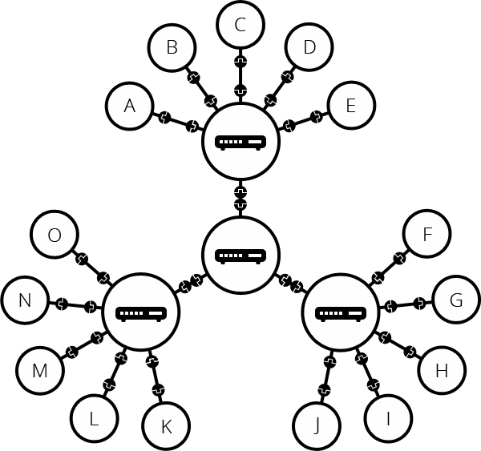

# 인터넷은 어떻게 작동될까?

인터넷은 앱의 핵심적인 기술이다. 컴퓨터들이 서로 통신 가능한 거대한 네트워크 이것이 인터넷이다.

 

### 인터넷의 역사

인터넷은 1960년 대 미육군에서 기금한 연구 프로젝트에서 시작되었다. 그리고 1980년 대에 많은 국립 대학과 비공개 기업의 지원으로 공공의 기반으로 변화되었다. 인터넷을 지원하는 다양한 기술은 시간이 지남에 따라 진화 해 왔지만 작동 방식은 그다지 변하지 않았다. 인터넷은 모든 컴퓨터를 연결하고 어떤 일이 있어도 연결 상태를 유지할 수있는 방법을 찾는 방법이다.

 

## 단순 네트워크

두 개의 컴퓨터가 통신이 필요할 때, 우리는 다른 컴퓨터와 물리적(이더넷 케이블) 또는 무선(wifi, bluetooth)연걸이 되어야 한다.

 

 

이러한 네트워크는 두 대의 컴퓨터로 제한되지 않고 원하는 만큼의 컴퓨터를 연결할 수 있다. 그러나 이렇게 연결할 수록 매우 복잡해지는데, 예를 들어 10대의 컴퓨터를 연결하려는 경우 컴퓨터 당 9개의 플러그가 달린 총 45개의 케이블이 필요하다.

 

 

이 문제를 해결하기 위해 네트워크라는 각 컴퓨터는 `라우터`라고 하는 특수한 소형 컴퓨터에 연결된다. 이 `라우터`에는 단 하나의 작업만 있는데 철도역의 신호원처럼 주어진 컴퓨터에서 보낸 메세지가 올바른 대상 컴퓨터에 도착하는지 확인하는 작업이다. 컴퓨터 B에게 메세지를 보내려면 컴퓨터 A가 메세지를 `라우터`로 보내야하며, `라우터`는 메세지를 컴퓨터 B로 전달하고 메세지가 컴퓨터 C로 전달되지 않도록 해야한다.

이 `라우터`를 시스템에 추가하려면 10대의 컴퓨터 네트워크에는 10개의 케이블만 필요하다. 각 컴퓨터마다 단일 플러그와 10개의 플러그가 있는 하나의 라우터가 필요하다.

 

 

## 네트워크 속의 네트워크

만약 수백, 수천, 수십억 대의 컴퓨터를 연결하는 것은 어떨까? 물론 단일 라우터는 그 정도까지 확장할 수는 없지만 라우터는 다른 컴퓨터와 마찬가지로 컴퓨터라고 했다. 그렇다면, 두 대의 라우터를 연결하는 경우도 가능하다.

 

 

컴퓨터를 라우터에 연결하고 라우터에서 라우터로, 우리는 무한히 확장할 수 있다.

 

 

이러한 네트워크는 우리가 인터넷이라 부르는 것에 매우 가깝지만, 다른 지역간, 아주 먼 곳의 케이블을 연결할 수는 없다. 이 문제를 해결하기 위해서 네트워크를 전화 시설과 연결하기 위한 `모뎀`이라는 특수 장비가 필요하다. 이 `모뎀`은 우리 네트워크의 정보를 전화 시설에서 처리할 수 있는 정보로 바꾸며 그 반대의 경우도 마찬가지다.

 

 

그래서 우리의 네트워크는 전화 시설에 연결된다. 다음 단계는 우리의 네트워크에서 목적지로 메세지를 보내는 것인데, 그렇게 하기 위해 네트워크 인터넷 서비스 제공 업체(Internet Service Provider, ISP)에 연결한다. ISP는 모두 함께 연결되는 몇몇 특수한 라우터를 관리하고, 다른 ISP의 라우터에도 액세스 할 수 있는 회사이다. 따라서 우리 네트워크의 메세지는 ISP 네트워크의 네트워크를 통해 목적지로 전달된다. 인터넷은 이러한 전체 네트워크 인프라로 구성된다.

 

 
