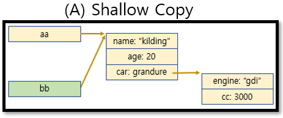
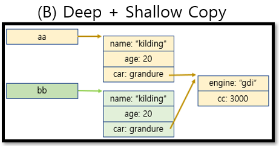
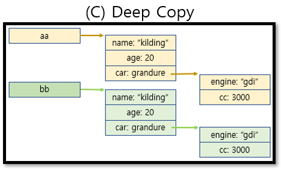

# Mutation

새로운 변수를 생성하거나 기존 변수를 재할당하지 않고 JavaScript의 객체 또는 배열을 변경할 때 예상치 못한 mutation(변이)이 일어난다.

다음 예시를 보자

```
// 다음 코드에서 x와 y의 값은??
const x = [1, 2, 3];
const y = x.reverse();
y.push(0);
```

위의 코드에서 y의 값은 쉽게 알 수 있다.
x의 배열을 역순으로 나열하고 0을 push한 값인 [3, 2, 1, 0]의 number배열을 가진다.

그렇다면 x의 값은 어떨까? 여전히 [1, 2, 3]이거나 x를 뒤집었으니 x도 [3, 2, 1]일까?

답은 둘다 아닌 [3, 2, 1, 0]의 값을 가진다.

분명히 y.push(0)을 했는데 왜 x에도 0이 push 됐을까?

한가지 예시를 더 보자

```
const nameObj = {
    name: "kim"
};
const nameObj2 = nameObj;
nameObj2.name = "kwon";
console.log(nameObj.name, nameObj2.name);
```

위의 코드에서 nameObj.name의 값과 nameObj2.name의 값은 각각 어떻게 나올까?
각각 "kim"과 "kwon"이 나올까?

그렇지 않다. 둘다 모두 "kwon"으로 나온다.

앞의 두 가지 예시에서 일어난 이슈의 원인은 Javascript의 배열과 객체의 복사 방식에 있다.

<br><hr>

## 참조에 의한 복사

결론부터 말하자면, 두 가지 경우 모두 참조에 의한 복사가 이루어졌기 때문에 발생한 이슈이다. 그렇다면 참조에 의한 복사가 무엇인지 알아보자.

참조에 의한 복사에 대해 모르는 상태였다면 예시 코드에서 의문점을 제기했어야 한다.

```
const x = [1, 2, 3];
const y = x.reverse();
y.push(0);
```

x와 y는 분명 `const`로 선언된 변수이다. 그런데 왜 값이 바뀌었을까? 라는 의문점에서 접근할 필요가 있다.

그 이유는 x와 y에 배열이 저장된것이 아니라 배열이 저장된 주소값이 저장되었기 때문이다. (객체도 마찬가지)

예시에서 사용된 복사는 `shallow copy`라는 얕은 복사인데 이를 해결하는 방법을 한번 알아보자


<br><hr>

## Shallow Copy, Deep+Shallow Copy, Deep Copy

<br>

### Shallow Copy

- 기존 배열/객체의 주소값을 참조

    

<br>

### Deep + Shallow Copy

- 새로운 주소의 객체를 만들어 기존객체의 프로퍼티와 원시형까지 복사가 되었지만 `다른 주소의 객체를 참조하는 프로퍼티는 주소값을 복사`

    

    Deep + Shallow Copy의 대표적인 예시
    - spread 문법 `...`

        ```
        const x = [1, 2, 3];
        const y = [...x].reverse();
        y.push(0);
        console.log(x, y);  // [1, 2, 3] [3, 2, 1, 0]
        ```

<br>

### Deep Copy

- 객체내의 객체까지 주소 복사가 아닌 내부 객체의 구조까지 새로 생성하여 복사

    

    Deep Copy의 예시
    - JSON 객체의 메소드 이용
    - 새로운 객체를 만들고 기존 객체의 프로퍼티들을 순회하여 원시수준까지 프로퍼티 복사
    - lodash의 cloneDeep() 사용

<br><hr>

## Mutation을 지양해야 하는 이유

### mutation이 가지는 문제

1. mutation은 디버그하기 어려운 코드를 만든다. 데이터가 값을 보존하지 않고, 어디서 변경 되었는지 알기 어렵다.
2. mutation은 코드를 이해하기 어렵게 만든다. 언제든지 배열이나 객체가 다른 값을 가질 수 있기 때문에 가독성이 떨어진다.
3. 함수 인자의 mutation는 함수의 동작을 예측할 수 없게 만든다.

<br>

### Mutating array methods

JavaScript의 모든 메소드가 새로운 레퍼런스의 배열이나 객체를 반환하는 것은 아니다. 일부 메소드는 기존 레퍼런스를 변경한다.

- Array.push()
- Array.replace()
- Array.splice()
- Array.slice()
- Array.filter()
- Array.map()

위의 배열 메서드들은 필자가 종종 사용하는 메서드중 일부이다. 이 중 원본 배열을 mutation하는 메서드를 구분할 수 있을까? 

직접 써보면서 확인하거나 외우지 않는 이상 구분하기 어렵다.

mutation을 지양하기 위해 이런 메서드들을 주의하면서 사용해야 할 필요가 있다.