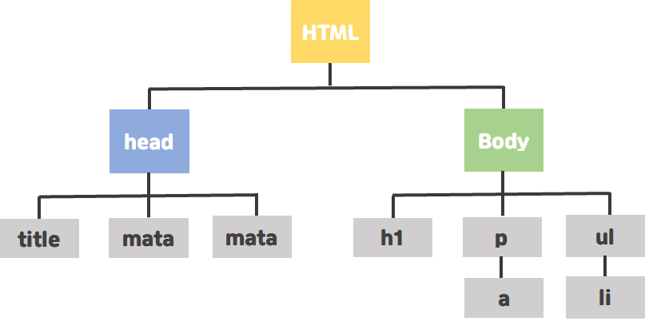
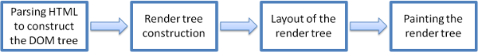
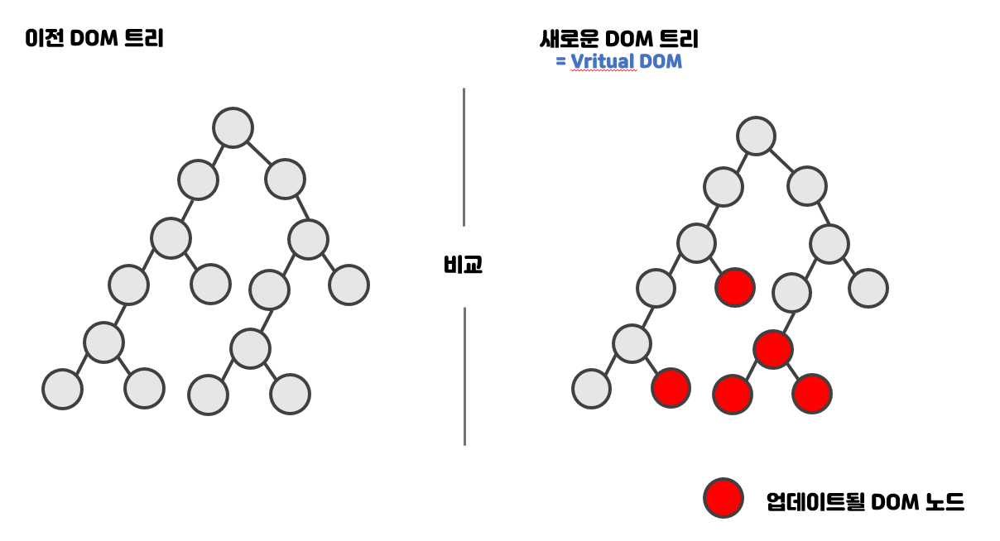

# Virture DOM

React의 특징중에는 Virtual DOM이 있다. 근데 Virtual DOM이 무엇일까?

그 전에 먼저 DOM 무엇인지 알아보아야 한다.

## DOM

DOM은 `Document Object Model` 의 약자로 문서 객체 모델을 의미하는데, 이는 웹 페이지를 이루는 태그들을 자바스크립트가 이용할 수 있게끔 브라우저가 트리구조로 만든 객체 모델을 의미한다.

문서 객체란 html, head, body와 같은 태그들을 javascript가 이용할 수 있는 (메모리에 보관할 수 있는) 객체를 의미한다.

HTML의 DOM tree

즉, DOM은 HTML과 Javascript를 서로 이어주는 역할을 하는 것이다.

 

## DOM vs Virture DOM

React에서 사용하는 가상 DOM도 실제 DOM 내용에 기반하여 만들어진다. 그렇다면 왜 Virtual DOM을 사용해야 할까? 

그 이유는 실제 DOM에는 브라우저가 화면을 그리는데 필요한 모든 정보가 들어있어 실제 DOM을 조작하는 작업이 무겁기 때문이다. 그래서 React에서는 실제 DOM의 변경 사항을 빠르게 파악하고 반영하기 위해서 내부적으로 가상 DOM을 만들어서 관리한다.

웹브라우저 단에서 DOM 변화가 일어나면 웹브라우저가 CSS를 다시 연산하고 레이아웃을 구성하고, 페이지를 리 페인트 즉 렌더링이 일어 나는 이 과정에서 시간이 허비된다는 것을 알 수 있다.

브라우저의 렌더링 엔진의 동작 과정을 떠올려 보자.

1. DOM 트리 구축을 위한 HTML, CSS 파싱
2. 렌더 트리 구축
3. 렌더 트리 배치
4. 렌더 트리 그리기(paint)

위의 과정들을 거치고 합치는 과정까지를 `렌더링`이라고 칭하고, 이 과정들은 렌더링이 일어날 때마다 진행된다.

그리고 이 렌더링 과정은 상황에 따라 여러번 반복하여 발생할 수 있고 
돔이 추가,삭제 혹은 태그 위치가 변하는 경우 렌더링이 일어난다.

여기까지 Virture DOM 사용을 해야하는 이유를 알아보았다.

 

## Virture DOM

그렇다면 Virtual DOM은 이 과정을 어떻게 효율적으로 처리할까?

Virtual DOM을 사용하면 실제 DOM에 접근하며 조작하는 대신, 이를 추상화한 자바스크립트 객체를 구성하여 사용한다.

DOM의 상태를 메모리에 저장하고, 변경 전과 변경 후의 상태를 비교 한뒤 최소한의 내용만 반영하여 성능 향상을 이끌어낸다. DOM의 상태를 메모리 위에 계속 올려두고, DOM에 변경 있을 경우 해당 변경 사항만 반영하는 것이다.

그림을 보면서 이해해보자

1. 데이터가 업데이트 되면, 전체 UI를 Virtual DOM에 리렌더링
2. 이전 Virtual DOM에 있던 내용과 현재의 내용을 비교함 (가상 돔 끼리 비교)
3. 바뀐 부분만 실제 DOM에 적용이 됨 (컴포넌트가 업데이트 될 때 레이아웃 계산이 한번만 이뤄짐)

위의 그림에서 빨간 부분에 수정사항이 생기게 되면 Virtual DOM은 달라진 값을 탐지하여 변경하고 최종적인 결과물을 실제 DOM에 전달한다. 

만약 Virtual DOM이 없었더라면 DOM은 변경된 빨간 부분뿐만 아니라 모든 원들을 빨간색으로 바꿔서 렌더링 했을 것이다. 사소한 변경사항에도 전체가 리렌더링되기 때문에 브라우저에 과부하가 올 수 있기 때문에 Virtual DOM의 역할은 중요하다.