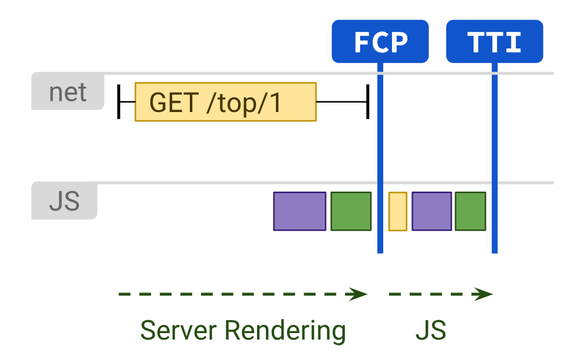

# CSR vs SSR

## CSR

- Client Side Rendering

    CSR은 JavaScript를 사용하여 클라이언트 쪽에서 직접 렌더링이 일어난다.  
    서버에서 요청을 받으면 클라이언트에 HTML과 JavaScript를 보내준다. 클라이언트는 그것을 받아 렌더링을 시작한다.

    모든 로직, data fetching, templating, routing은 클라이언트에서 처리된다.  
    최초 페이지 로딩 이후, JS를 사용해 동적으로 데이터를 변경하며 화면을 바꾼다. 서버는 JSON만 보내주는 역할을 하고, 클라이언트는 그 데이터를 가지고 HTML을 렌더링 한다.

 

### CSR의 장점

1. 후속 페이지 로드 시간이 더 빠르다.
2. 별도의 API를 호출할 필요가 없는 페이지거나 지연 로딩 모듈이 필요하지 않고, 이미 스크립트가 캐싱된 경우 인터넷 없이도 해당 CSR 웹앱을 실행할 수 있다.
3. 서버를 호출할 때마다 전체 UI를 다시 로드할 필요가 없다.

> 웹을 사용하면서 앱을 사용하는 것과 같은 경험

 

### CSR의 단점

1. 규모가 클수록, JS의 양의 증가
2. JS를 다운받고, 파싱한후 data를 가져온 후에 컨텐츠를 보여주기 때문에 초기 렌더링 속도가 느리다.
    - `code splitting` 혹은 `lazy loading`의 도입을 고려
3. `SEO`에 불리하다.
    - 웹 크롤러 봇들이 JS를 실행시키지 못하고 HTML에서만 컨텐츠 수집을 하기에 CSR방식으로 개발된 페이지를 빈페이지로 인식
    > SEO(Search Engine Optimization)이란 검색엔진에서 찾기 쉽도록 사이트를 개선하는 프로세스

 
 

## SSR

- Server Side Rendering

    SSR은 서버에서 full HTML을 만들어내는 방식이다. 모든 데이터가 매핑된 서비스 페이지를 클라이언트에게 바로 보여줄 수 있고, data fetching과 templating을 위한 추가적인 `RTT(Round Trip Time: 패킷 왕복 시간)`가 필요하지 않다.

 

### SSR의 장점

1. Time-to-Content가 빠르다.
    - 일반적으로 빠른 FP(FIrst Paint)와 FCP(First Contentful Paint)를 생성
2. 빠른 TTI(Time to Interactive)가 가능하다.
    - 서버에서 로직 및 렌더링을 실행하여 많은 JS를 클라이언트에 보내지 않음
3. SEO에 유리

 

### SSR의 단점

1. SSR은 서버에서 HTML을 생성하는데 시간이 걸린다는 점 때문에 TTFB(Time to FIrst Byte)는 느려질 수 있다.
2. 새로운 페이지를 요청할 때마다 새로고침이 발생한다.
3. 서버에 많은 부하를 줄 수 있다.
    - 새로운 페이지를 요청할 때마다 api를 새로 불러오게 된다.

 
 

## Universal Rendering

Universal Rendering은 SSR와 CSR을 적절히 함께 사용하는 방식으로 `Next.js`, `Nuxt.js`, `angular universal` 등이 이를 지원한다.

